# Waste Journey Tracking Portal — Activity Diagrams (All Panels)

Version: Draft 1 (pre-PRD) | Format: Mermaid (GitHub / VS Code Mermaid preview / mermaid.live)

---

## 0. Locked Decisions (inputs to these diagrams)

| Area | Decision |
|---|---|
| Roles | Admin, Collection, Transportation, RTS, Processing, Head Officer (+ Public tracking, no login) |
| Stage order | Strict: Collection → Transportation → RTS → Processing. Next stage locked until previous has a valid entry |
| Status | Derived automatically from latest valid stage entry |
| Corrections | Stage user: cannot edit/delete; submits a corrected entry (old one stays in history as superseded). Admin: can edit and delete (soft delete, reason mandatory, logged in history) |
| Master data | Admin manages Routes, Vehicles, RTS Locations, Processing Facilities, Process Types, Waste Categories, Drivers/Supervisors |
| Assignment | Admin assigns one user per stage at batch creation; stage user sees only assigned batches |
| Export | CSV and Excel (multi-sheet) |
| Public tracking | QR / Batch ID opens a public read-only page, no login |

### Stage fields

| Stage | Fields |
|---|---|
| Batch (Admin) | Batch ID (auto), date, waste type (Wet/Dry), quantity, source/area, route*, vehicle*, initial status, system datetime, assigned users (4 stages) |
| Collection | collection area/location, route*, vehicle*, waste type, quantity, collection date, exact time, driver/supervisor*, note |
| Transportation | start location, destination, RTS/next location*, vehicle*, departure datetime, arrival datetime (optional at first), journey duration (auto), note |
| RTS | RTS name*, RTS location (auto), arrival date, arrival time, quantity received, waste category*, handover/receiving details, next process/destination*, note |
| Processing | facility*, process type* (Composting / Recovery / Electricity generation / Disposal), arrival date, arrival time, quantity, final status (Processed / Recovered / Disposed / Completed), note |

`*` = dropdown from Master Data

---

## 1. Common — Login & Role Redirect

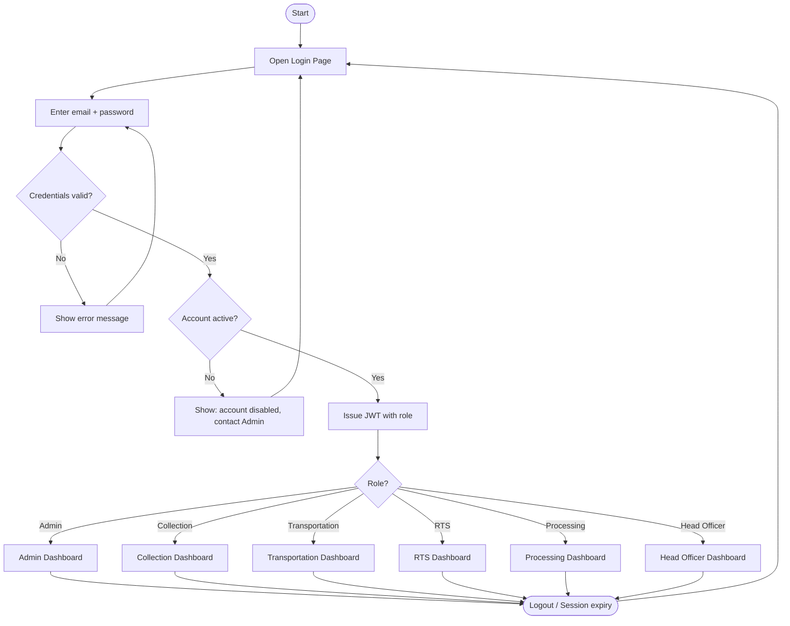

---

## 2. Admin Panel

### 2.1 Admin — Overview

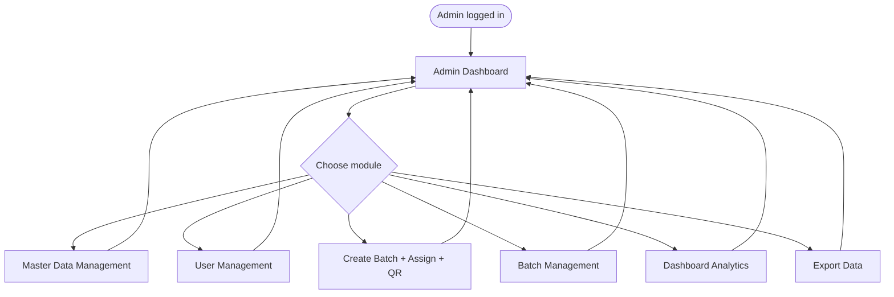

### 2.2 Admin — Master Data Management

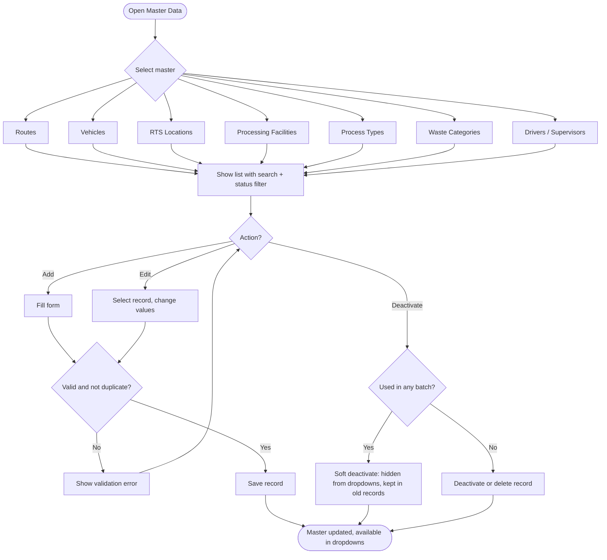

### 2.3 Admin — User Management

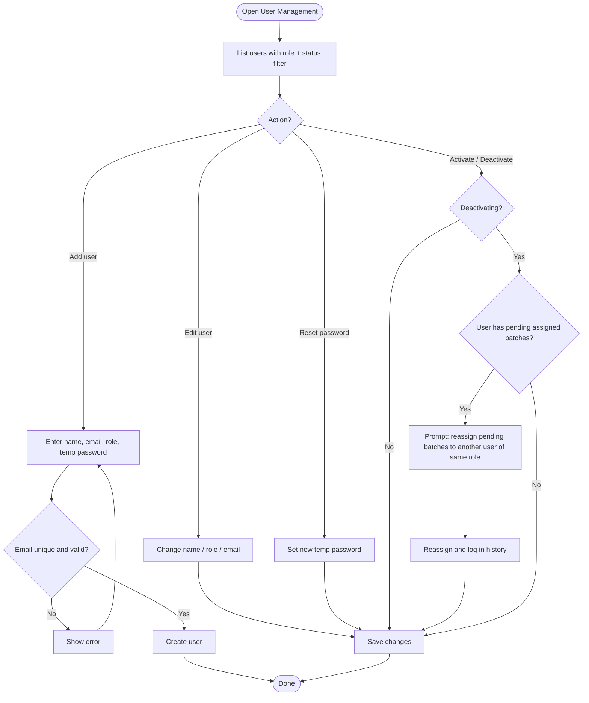

### 2.4 Admin — Create Batch + Assign Stage Users + Generate QR

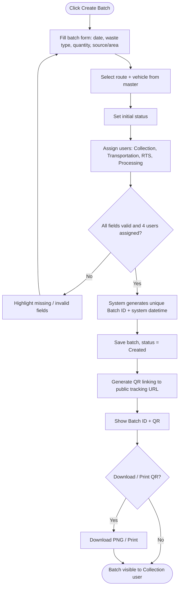

### 2.5 Admin — Batch Management (View, Reassign, Edit, Delete)

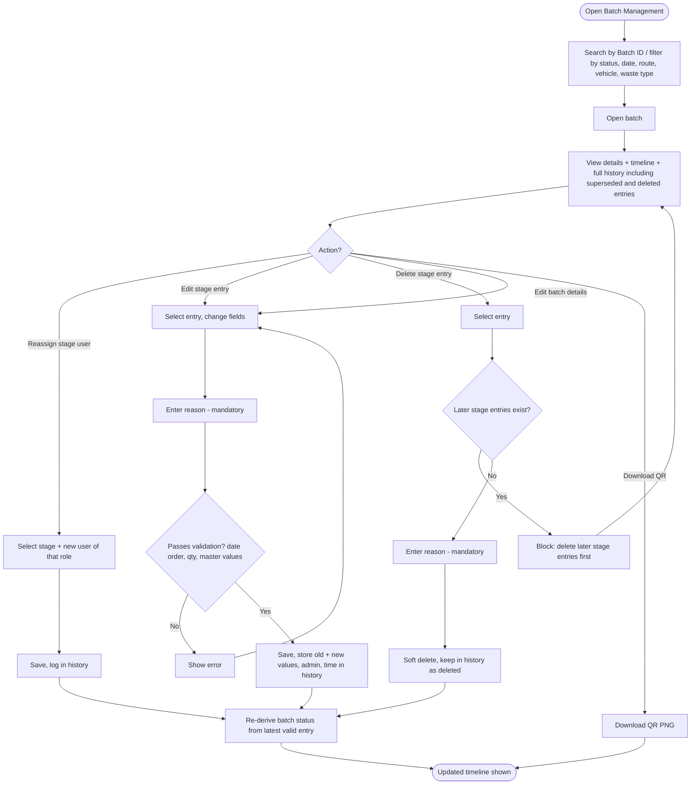

### 2.6 Admin — Dashboard (Detailed)

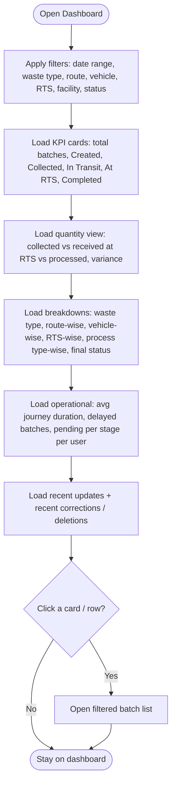

### 2.7 Admin — Export (CSV / Excel)

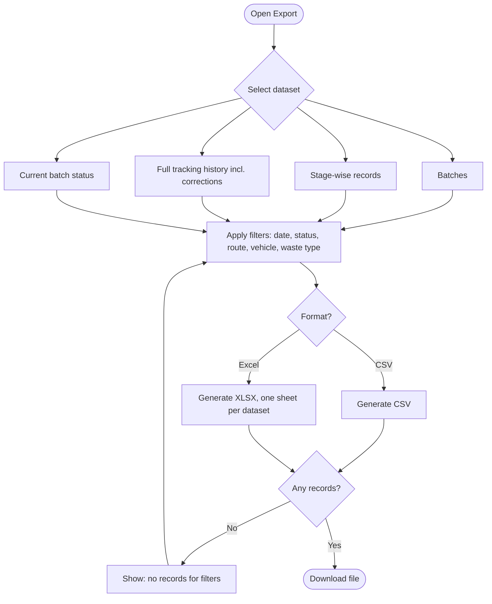

---

## 3. Collection Panel

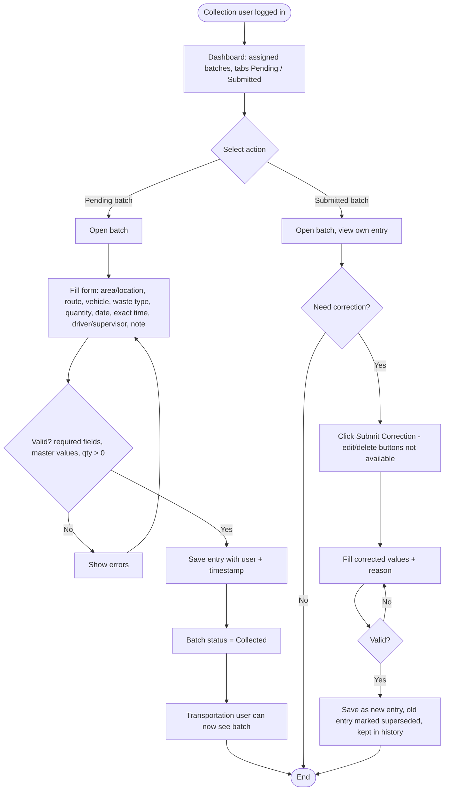

Permissions: add/correct Collection stage only on assigned batches. View-only for other stages. No edit/delete.

---

## 4. Transportation Panel

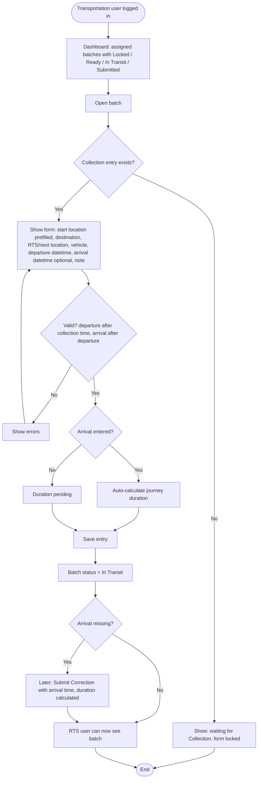

Permissions: add/correct Transportation stage only. Needs Collection entry. RTS unlocks only after arrival time is recorded.

---

## 5. RTS / Transfer Panel

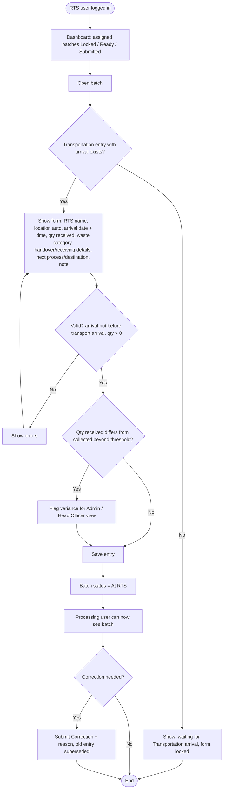

Permissions: add/correct RTS stage only. View-only for other stages.

---

## 6. Processing Panel

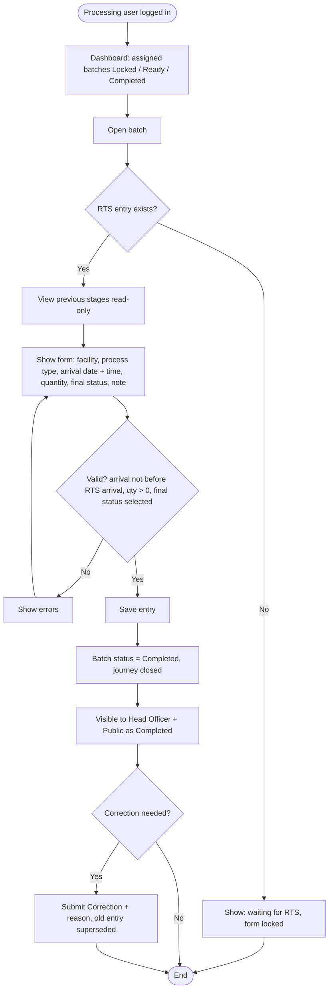

Permissions: add/correct Processing stage only. Cannot edit Collection, Transportation or RTS entries. After completion only Admin can edit/delete.

---

## 7. Head Officer Panel (View-Only)

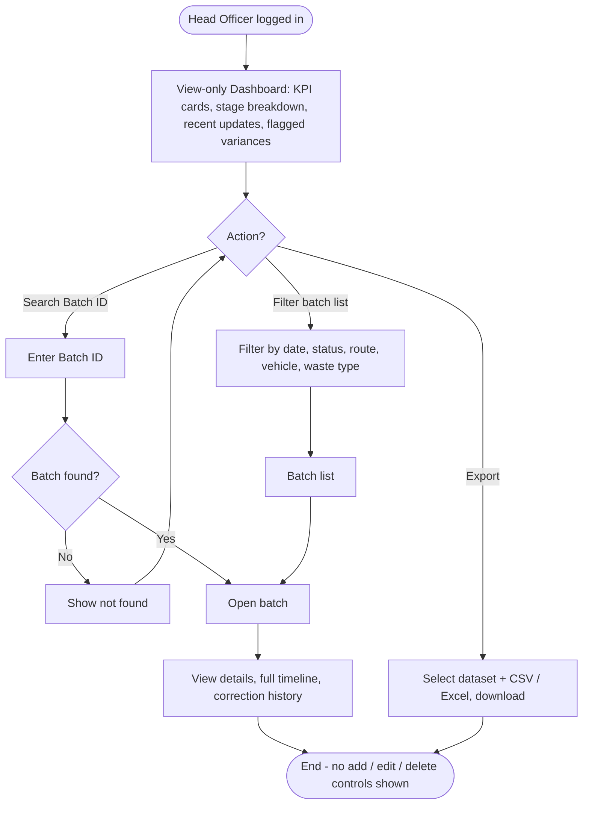

Permissions: read-only everywhere. Export allowed (read-only operation).

---

## 8. Public Tracking (No Login)

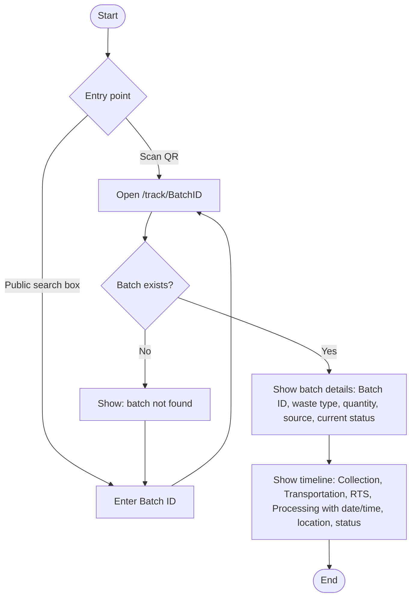

Public view hides: driver names, user names, vehicle numbers, correction/deleted history, internal notes.

---

## 9. End-to-End Swimlane

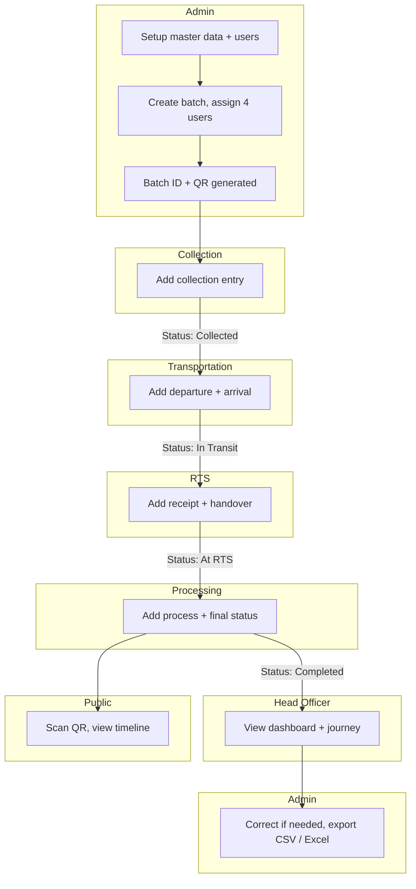

---

## 10. Batch Status Derivation

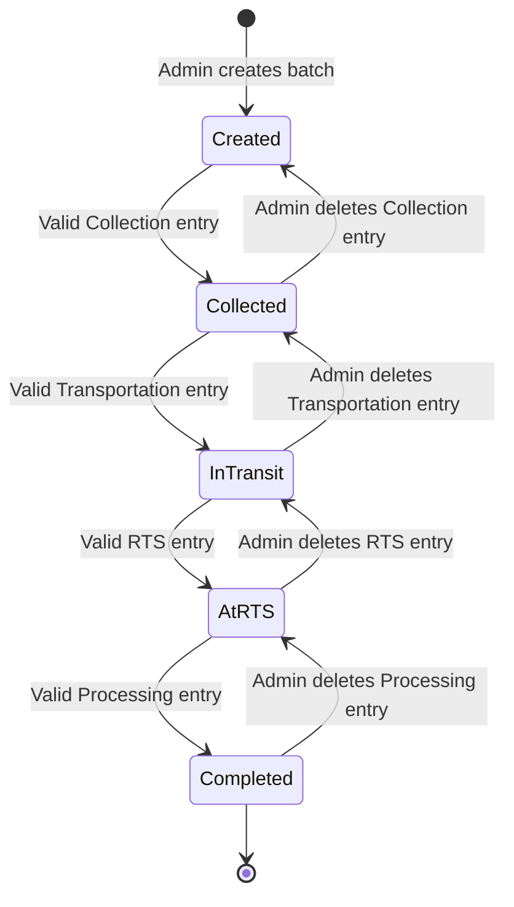

Rule: status = stage of the latest valid (not superseded, not deleted) entry. Admin deletion must go in reverse order (latest stage first).

---

## 11. Permission Matrix

| Action | Admin | Collection | Transportation | RTS | Processing | Head Officer | Public |
|---|---|---|---|---|---|---|---|
| Manage master data | Yes | No | No | No | No | No | No |
| Manage users | Yes | No | No | No | No | No | No |
| Create batch / assign users | Yes | No | No | No | No | No | No |
| Add own-stage entry | Yes | Collection | Transportation | RTS | Processing | No | No |
| Submit correction (own stage) | Yes | Yes | Yes | Yes | Yes | No | No |
| Edit / delete any entry | Yes (reason + history) | No | No | No | No | No | No |
| View assigned batches | All | Assigned | Assigned | Assigned | Assigned | All | By ID only |
| Full history + corrections | Yes | Own stage | Own stage | Own stage | Own stage | Yes | No |
| Dashboard | Detailed | Own queue | Own queue | Own queue | Own queue | Detailed read-only | No |
| Export CSV / Excel | Yes | No | No | No | No | Yes | No |
| Public tracking view | Yes | Yes | Yes | Yes | Yes | Yes | Yes |
