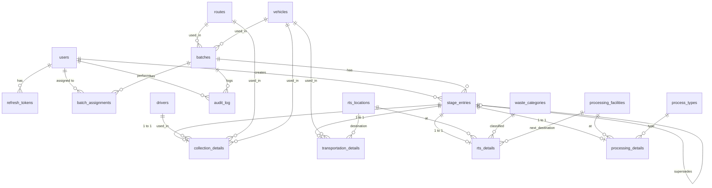
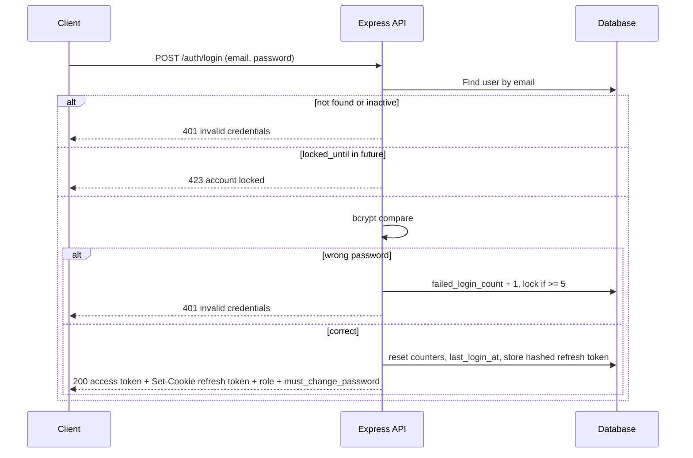
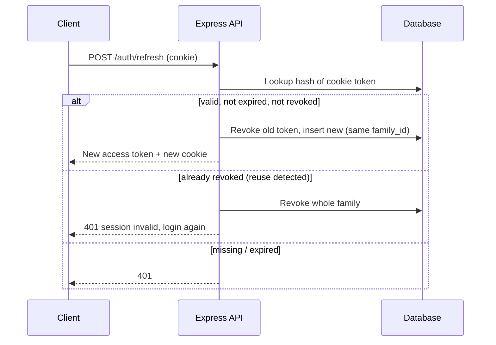
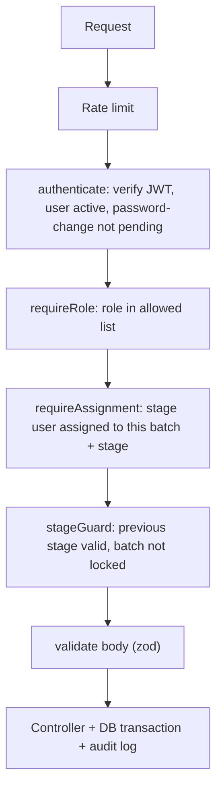

# Data Dictionary & Authentication System

Version: 1.0 | Related: `final_prd.md`, `activity_diagrams.md`
DB: Supabase PostgreSQL | Backend: Node.js + Express | Naming: snake_case, UUID primary keys, timestamps in UTC (`timestamptz`)

---

# PART A — DATA DICTIONARY

## A1. ERD

## A2. Enums

| Enum | Values |
|---|---|
| `user_role` | ADMIN, COLLECTION, TRANSPORTATION, RTS, PROCESSING, HEAD_OFFICER |
| `waste_type` | WET, DRY |
| `stage_type` | COLLECTION, TRANSPORTATION, RTS, PROCESSING |
| `entry_status` | ACTIVE, SUPERSEDED, DELETED |
| `batch_status` | CREATED, COLLECTED, IN_TRANSIT, AT_RTS, COMPLETED |
| `final_status` | PROCESSED, RECOVERED, DISPOSED, COMPLETED |
| `audit_action` | BATCH_CREATE, BATCH_EDIT, ASSIGN, REASSIGN, ENTRY_CREATE, ENTRY_CORRECT, ENTRY_ADMIN_EDIT, ENTRY_ADMIN_DELETE, USER_CREATE, USER_UPDATE, USER_DEACTIVATE, PASSWORD_RESET, MASTER_CHANGE |

Stage to status map: COLLECTION → COLLECTED, TRANSPORTATION → IN_TRANSIT, RTS → AT_RTS, PROCESSING → COMPLETED, none → CREATED.

---

## A3. Access & Auth Tables

### `users`

| Column | Type | Null | Default | Notes |
|---|---|---|---|---|
| id | uuid | No | gen_random_uuid() | PK |
| name | text | No | | |
| email | citext | No | | Unique, lowercase |
| password_hash | text | No | | bcrypt cost 12 |
| role | user_role | No | | |
| is_active | boolean | No | true | Deactivated users cannot log in |
| must_change_password | boolean | No | true | True for temp passwords |
| failed_login_count | int | No | 0 | Reset on success |
| locked_until | timestamptz | Yes | | Set after 5 failures |
| last_login_at | timestamptz | Yes | | |
| created_by | uuid | Yes | | FK users.id |
| created_at | timestamptz | No | now() | |
| updated_at | timestamptz | No | now() | |

Indexes: unique(email), (role, is_active).

### `refresh_tokens`

| Column | Type | Null | Notes |
|---|---|---|---|
| id | uuid | No | PK |
| user_id | uuid | No | FK users.id, on delete cascade |
| token_hash | text | No | SHA-256 of token, unique. Raw token never stored |
| family_id | uuid | No | Groups rotated tokens; reuse of old token revokes whole family |
| expires_at | timestamptz | No | 7 days from issue |
| revoked_at | timestamptz | Yes | |
| user_agent | text | Yes | |
| ip_address | inet | Yes | |
| created_at | timestamptz | No | now() |

Indexes: (user_id), unique(token_hash), (expires_at).

---

## A4. Master Data Tables

All master tables share: `id uuid PK`, `is_active boolean default true`, `created_at`, `updated_at`.

### `routes`

| Column | Type | Null | Notes |
|---|---|---|---|
| code | text | No | Unique, e.g. R-01 |
| name | text | No | Unique |
| description | text | Yes | |

### `vehicles`

| Column | Type | Null | Notes |
|---|---|---|---|
| vehicle_number | text | No | Unique, uppercase |
| vehicle_type | text | Yes | Truck, Tipper, Auto, etc. |
| capacity_kg | numeric(10,2) | Yes | |

### `rts_locations`

| Column | Type | Null | Notes |
|---|---|---|---|
| name | text | No | Unique |
| location | text | No | Address/area, auto-filled in RTS form |

### `processing_facilities`

| Column | Type | Null | Notes |
|---|---|---|---|
| name | text | No | Unique |
| location | text | No | |

### `process_types`

| Column | Type | Null | Notes |
|---|---|---|---|
| name | text | No | Unique. Seed: Composting, Recovery, Electricity Generation, Disposal |

### `waste_categories`

| Column | Type | Null | Notes |
|---|---|---|---|
| name | text | No | Unique, e.g. Organic, Plastic, Paper, Mixed |

### `drivers`

| Column | Type | Null | Notes |
|---|---|---|---|
| name | text | No | |
| phone | text | Yes | |
| designation | text | No | Driver or Supervisor |

Rule: master rows referenced anywhere cannot be hard-deleted; only `is_active = false`.

---

## A5. Core Tables

### `batches`

| Column | Type | Null | Default | Notes |
|---|---|---|---|---|
| id | uuid | No | gen_random_uuid() | PK |
| batch_code | text | No | | Unique. Format `WB-YYYY-NNNN` from a DB sequence. This is the public Batch ID |
| batch_date | date | No | | |
| waste_type | waste_type | No | | |
| quantity | numeric(12,2) | No | | kg, > 0 |
| source_area | text | No | | |
| route_id | uuid | No | | FK routes.id |
| vehicle_id | uuid | No | | FK vehicles.id |
| initial_status | batch_status | No | 'CREATED' | Fixed at creation |
| current_status | batch_status | No | 'CREATED' | Derived, updated transactionally |
| current_stage | stage_type | Yes | | Latest valid stage, null when CREATED |
| created_by | uuid | No | | FK users.id (Admin) |
| created_at | timestamptz | No | now() | System datetime |
| updated_at | timestamptz | No | now() | |

Indexes: unique(batch_code), (current_status), (batch_date), (route_id), (vehicle_id), (waste_type).
Checks: quantity > 0.

### `batch_assignments`

| Column | Type | Null | Default | Notes |
|---|---|---|---|---|
| id | uuid | No | gen_random_uuid() | PK |
| batch_id | uuid | No | | FK batches.id |
| stage | stage_type | No | | |
| user_id | uuid | No | | FK users.id; user.role must match stage |
| assigned_by | uuid | No | | FK users.id |
| assigned_at | timestamptz | No | now() | |
| is_active | boolean | No | true | False when reassigned |

Indexes: partial unique (batch_id, stage) WHERE is_active; (user_id, is_active).
Role to stage match enforced in service layer (COLLECTION user to COLLECTION stage, etc.).

### `stage_entries` (common part of every stage record)

| Column | Type | Null | Default | Notes |
|---|---|---|---|---|
| id | uuid | No | gen_random_uuid() | PK |
| batch_id | uuid | No | | FK batches.id |
| stage | stage_type | No | | |
| version_no | int | No | 1 | Increments per correction |
| status | entry_status | No | 'ACTIVE' | ACTIVE = current valid |
| supersedes_id | uuid | Yes | | FK stage_entries.id (previous version) |
| event_time | timestamptz | No | | Collection time / departure / RTS arrival / processing arrival |
| display_location | text | No | | Derived by service for timeline (see below) |
| note | text | Yes | | Max 500 chars |
| created_by | uuid | No | | FK users.id |
| created_at | timestamptz | No | now() | |
| deleted_by | uuid | Yes | | Admin |
| deleted_at | timestamptz | Yes | | |
| delete_reason | text | Yes | | Required when DELETED |

Indexes: partial unique (batch_id, stage) WHERE status = 'ACTIVE'; (batch_id, stage, status); (created_by); (event_time).

`display_location` rule: Collection = collection area; Transportation = `start to destination`; RTS = RTS location name; Processing = facility name.

### `collection_details` (1:1 with stage_entries where stage = COLLECTION)

| Column | Type | Null | Notes |
|---|---|---|---|
| entry_id | uuid | No | PK + FK stage_entries.id |
| collection_area | text | No | |
| route_id | uuid | No | FK routes.id |
| vehicle_id | uuid | No | FK vehicles.id |
| waste_type | waste_type | No | |
| quantity | numeric(12,2) | No | kg, > 0 |
| driver_id | uuid | No | FK drivers.id (driver/supervisor) |

Collection date and exact time = `stage_entries.event_time`.

### `transportation_details` (stage = TRANSPORTATION)

| Column | Type | Null | Notes |
|---|---|---|---|
| entry_id | uuid | No | PK + FK stage_entries.id |
| start_location | text | No | Prefilled from collection |
| destination | text | No | |
| rts_location_id | uuid | No | FK rts_locations.id (RTS / next location) |
| vehicle_id | uuid | No | FK vehicles.id |
| departure_time | timestamptz | No | Equals stage_entries.event_time |
| arrival_time | timestamptz | Yes | Optional first; added through correction |
| duration_minutes | int | Yes | Generated: arrival - departure; null while arrival missing |

Check: arrival_time is null or arrival_time >= departure_time.

### `rts_details` (stage = RTS)

| Column | Type | Null | Notes |
|---|---|---|---|
| entry_id | uuid | No | PK + FK stage_entries.id |
| rts_location_id | uuid | No | FK rts_locations.id (name + location) |
| quantity_received | numeric(12,2) | No | kg, > 0 |
| waste_category_id | uuid | No | FK waste_categories.id |
| handover_details | text | No | Receiving person / handover note |
| next_facility_id | uuid | No | FK processing_facilities.id (next process/destination) |
| variance_pct | numeric(6,2) | Yes | (received - collected) / collected x 100, calculated by service |
| is_flagged | boolean | No | true if abs(variance_pct) > threshold |

Arrival date and time = `stage_entries.event_time`.

### `processing_details` (stage = PROCESSING)

| Column | Type | Null | Notes |
|---|---|---|---|
| entry_id | uuid | No | PK + FK stage_entries.id |
| facility_id | uuid | No | FK processing_facilities.id |
| process_type_id | uuid | No | FK process_types.id |
| quantity | numeric(12,2) | No | kg, > 0 |
| final_status | final_status | No | |

Arrival date and time = `stage_entries.event_time`.

### `audit_log`

| Column | Type | Null | Notes |
|---|---|---|---|
| id | bigserial | No | PK |
| action | audit_action | No | |
| batch_id | uuid | Yes | FK batches.id |
| entry_id | uuid | Yes | FK stage_entries.id |
| entity_type | text | Yes | user, batch, entry, master |
| entity_id | uuid | Yes | For non-batch entities |
| old_values | jsonb | Yes | |
| new_values | jsonb | Yes | |
| reason | text | Yes | Required for correct / admin edit / admin delete |
| performed_by | uuid | No | FK users.id |
| performed_at | timestamptz | No | now() |

Indexes: (batch_id, performed_at), (performed_by), (action).
Append-only: no update/delete permitted by application.

### `app_settings`

| Column | Type | Notes |
|---|---|---|
| key | text | PK. Example: `variance_threshold_pct` |
| value | text | Example: `10` |
| updated_by, updated_at | | |

---

## A6. Business Rules Mapped to Data

| Rule | Where enforced |
|---|---|
| One valid entry per stage per batch | Partial unique index on stage_entries |
| Stage order | Service: previous stage must have ACTIVE entry (Transportation arrival_time not null before RTS) |
| Time order | Service validation + CHECK on transportation_details |
| Correction | Transaction: old row status = SUPERSEDED, insert new row version_no + 1 with supersedes_id, insert detail row, update batch status, write audit_log |
| Admin edit | Transaction: update detail/entry row, write audit_log with old/new + reason, recompute batch status |
| Admin delete | Block if any later stage ACTIVE entry exists; else status = DELETED with deleted_by/at/reason; recompute batch status |
| Status derivation | `current_stage` = highest-order stage with ACTIVE entry; `current_status` from map in A2 |
| Variance flag | On RTS save: compare with Collection active quantity; threshold from app_settings |
| Duration | Generated column from departure/arrival |
| Role-stage assignment | Assigned user's role must equal stage |

---

## A7. Dashboard Query Sources

| Widget | Source |
|---|---|
| KPI counts by status | `batches.current_status` group by |
| Quantity funnel | collection_details.quantity, rts_details.quantity_received, processing_details.quantity (ACTIVE entries only) |
| By waste type / route / vehicle | `batches` joins |
| By RTS / facility / process type / final status | rts_details, processing_details with master joins |
| Avg journey duration | transportation_details.duration_minutes |
| Delayed / stuck batches | batches where updated_at older than threshold and status != COMPLETED |
| Pending per stage per user | batch_assignments left join ACTIVE stage_entries |
| Flagged variances | rts_details.is_flagged |
| Recent updates / corrections | stage_entries, audit_log |

Export datasets: Batches (`batches` + assignments), Stage-wise (`stage_entries` + detail tables, ACTIVE), Full history (all statuses + audit_log), Current status (`batches` current fields).

---

## A8. Seed Data

| Item | Seed |
|---|---|
| Users | 1 Admin, 1 each for Collection, Transportation, RTS, Processing, Head Officer (temp passwords, must_change_password = true) |
| process_types | Composting, Recovery, Electricity Generation, Disposal |
| waste_categories | Organic, Plastic, Paper, Mixed |
| routes / vehicles / rts_locations / processing_facilities / drivers | 2 to 3 demo rows each |
| app_settings | variance_threshold_pct = 10 |
| Demo batches | 4 batches at different stages (Created, Collected, In Transit, Completed) |

---

# PART B — AUTHENTICATION & AUTHORIZATION SYSTEM

## B1. Design Summary

| Item | Decision |
|---|---|
| Method | Email + password, custom JWT in Express (no third-party auth) |
| Access token | JWT, 15 min, signed HS256 (secret in env), payload: `sub` (user id), `role`, `iat`, `exp` |
| Refresh token | Random 64-byte value, 7 days, stored hashed in `refresh_tokens`, rotated on every use |
| Transport | Refresh token in httpOnly, Secure cookie. Access token returned in JSON body and kept in memory on client (not localStorage) |
| Cross-site | Frontend (Vercel) and API (Render) are different sites: cookie `SameSite=None; Secure`, CORS with exact origin + `credentials: true` |
| CSRF | Refresh/logout endpoints only accept cookie plus `X-Requested-With` header and exact Origin check; other endpoints use Bearer header (not cookie), so not CSRF-exposed |
| Password hash | bcrypt cost 12 |
| Roles | Six roles from `user_role`; role read from DB on sensitive actions, not trusted from token alone for deactivated users |

## B2. Login Flow

Rules:
- Same error message for unknown email and wrong password (no user enumeration).
- Lock for 15 minutes after 5 consecutive failures.
- If `must_change_password` is true, client is redirected to Change Password; API blocks everything except `/auth/change-password` and `/auth/logout` until changed (error `PASSWORD_CHANGE_REQUIRED`).

## B3. Token Refresh & Logout

- Logout: revoke current refresh token, clear cookie.
- Password change or reset: revoke all refresh tokens of that user.
- Deactivating a user: revoke all refresh tokens immediately; access token expires within 15 min and `authenticate` middleware also checks `is_active` for every request via a cached lookup (30 s cache).

## B4. Password Policy

| Rule | Value |
|---|---|
| Min length | 8, must include letter + number |
| Temp password | Generated by Admin screen, random 10 chars, shown once |
| First login | Must change |
| Reuse | New password cannot equal current |
| Reset | Admin sets new temp password (no email flow in scope) |

## B5. Authorization Layers (middleware order)

| Layer | Purpose | Failure |
|---|---|---|
| authenticate | Valid token, active user | 401 |
| requireRole | Endpoint allowed for role | 403 |
| requireAssignment | Stage user is the active assignee of (batch, stage). Admin bypasses | 403 |
| stageGuard | Entry stage must equal user role; previous stage ACTIVE; Transportation arrival present before RTS | 409 `STAGE_LOCKED` |
| validate | Required fields, time order, quantity, master active | 422 |

Stage is never taken from request body for stage users; it is derived from `user.role`.

## B6. Endpoint-Role Matrix

Legend: A = Admin, C = Collection, T = Transportation, R = RTS, P = Processing, H = Head Officer, Pub = Public. Stage roles marked (own) are limited to own stage and assigned batches.

| Endpoint | Method | A | C/T/R/P | H | Pub |
|---|---|---|---|---|---|
| /auth/login | POST | Y | Y | Y | Y |
| /auth/refresh, /auth/logout | POST | Y | Y | Y | Y |
| /auth/change-password | POST | Y | Y | Y | No |
| /users, /users/:id | GET, POST, PATCH | Y | No | No | No |
| /users/:id/reset-password, /deactivate | POST | Y | No | No | No |
| /master/:type | GET (dropdowns) | Y | Y | Y | No |
| /master/:type | POST, PATCH, deactivate | Y | No | No | No |
| /batches | POST | Y | No | No | No |
| /batches | GET list | all | assigned (own) | all | No |
| /batches/:id | GET detail + history | all | assigned, own-stage history | all | No |
| /batches/:id | PATCH | Y | No | No | No |
| /batches/:id/assignments | PUT (reassign) | Y | No | No | No |
| /batches/:id/qr | GET | Y | No | Y | No |
| /batches/:id/entries | POST (add stage entry) | Y | own | No | No |
| /entries/:id/correct | POST | Y | own | No | No |
| /entries/:id | PATCH (admin edit) | Y | No | No | No |
| /entries/:id | DELETE (admin soft delete) | Y | No | No | No |
| /public/track/:batchCode | GET | Y | Y | Y | Y |
| /dashboard/* | GET | full | own queue | full read-only | No |
| /export/:dataset?format=csv or xlsx | GET | Y | No | Y | No |
| /audit | GET | Y | No | Y (read) | No |

## B7. Public Endpoint Rules

- `/public/track/:batchCode` needs no token.
- Response built from a fixed whitelist: batch_code, waste_type, quantity, source_area, current_status, timeline [stage, event_time, display_location, status].
- Never returns: driver/user names, vehicle numbers, notes, handover details, correction/deleted entries, assignments.
- Rate limit: 60 requests/min per IP. Unknown code returns 404 with generic body.

## B8. Security Controls

| Control | Detail |
|---|---|
| HTTPS | Enforced by Vercel / Render |
| Headers | helmet (HSTS, noSniff, frameguard), strict CORS origin |
| Rate limits | Login 10/min per IP, public 60/min per IP, general API 300/min per user |
| Validation | zod schemas on every body/query/param |
| SQL | Parameterized queries only |
| Secrets | `JWT_SECRET`, `DATABASE_URL`, `SUPABASE_SERVICE_KEY`, `CORS_ORIGIN`, `COOKIE_DOMAIN` in env; service key never sent to frontend; Supabase RLS enabled with no public policies (API is only access path) |
| Logging | No passwords/tokens in logs; audit_log for business events |
| Frontend | Access token in memory; silent refresh on 401 once; route guards by role (UX only, server is authority) |

## B9. Error Codes

| HTTP | Code | Meaning |
|---|---|---|
| 401 | INVALID_CREDENTIALS | Login failed |
| 401 | TOKEN_EXPIRED / TOKEN_INVALID | Refresh or re-login |
| 403 | FORBIDDEN_ROLE | Role not allowed |
| 403 | NOT_ASSIGNED | Not assignee of this batch/stage |
| 403 | PASSWORD_CHANGE_REQUIRED | Must change temp password |
| 404 | NOT_FOUND | Missing batch/entry |
| 409 | STAGE_LOCKED | Previous stage incomplete |
| 409 | ENTRY_EXISTS | Active entry already exists (use correction) |
| 409 | DELETE_BLOCKED | Later stage entries exist |
| 422 | VALIDATION_FAILED | Field errors list |
| 423 | ACCOUNT_LOCKED | Too many attempts |
| 429 | RATE_LIMITED | Too many requests |

## B10. Auth Test Checklist

| # | Test | Expected |
|---|---|---|
| 1 | Login each of 6 roles | Correct dashboard redirect |
| 2 | 5 wrong passwords | Locked 15 min, 423 |
| 3 | Temp-password user calls any API | 403 PASSWORD_CHANGE_REQUIRED |
| 4 | Expired access token with valid cookie | Silent refresh succeeds |
| 5 | Reuse old refresh token | Whole family revoked |
| 6 | Deactivated user with live access token | Blocked within 30 s, refresh fails |
| 7 | Collection user POST entry for Transportation stage | Stage forced to COLLECTION, no way to write other stage |
| 8 | Stage user on batch not assigned | 403 NOT_ASSIGNED |
| 9 | Head Officer POST/PATCH/DELETE anything | 403 |
| 10 | Stage user PATCH/DELETE entry | 403 |
| 11 | Transportation entry before Collection | 409 STAGE_LOCKED |
| 12 | Public endpoint response | No restricted fields |
| 13 | Public endpoint 61st request in a minute | 429 |
