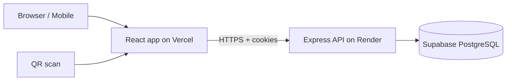

# Final PRD — Waste Journey Tracking Portal

Version: 1.1 | Status: Final (synced with pages spec) | Related docs: `activity_diagrams.md`, `pages_spec.md`, `data_dictionary_and_auth.md`

Change log v1.1: added Profile, stage-user History, Audit Log, Settings pages; new APIs (`/me`, `/me/history`, `/auth/logout-all`, `/dashboard/queue`, `/settings`, `/audit`); acceptance criteria and delivery plan updated; page count 36.

---

## 1. Overview

**Product:** Web portal to create waste batches and track each batch through Collection → Transportation → RTS/Transfer → Processing using a unique Batch ID and QR code.

**Type:** Academic/demo prototype, built production-style (role-based access, history, master data, exports).

**Primary objective:** Complete journey and history of a waste batch viewable in one place using its Batch ID.

### 1.1 Goals

| # | Goal |
|---|---|
| G1 | One tracking record per batch with a continuous identity (Batch ID + QR) |
| G2 | Stage-wise data entry by assigned role users with strict stage order |
| G3 | Full history preserved: corrections, admin edits, deletions, reassignments |
| G4 | Consistent data via master data dropdowns |
| G5 | Detailed monitoring dashboard and CSV/Excel export |
| G6 | Public QR tracking page, mobile-friendly field entry |
| G7 | Accountability: audit log for management, personal history and profile for every user |

### 1.2 Non-Goals

- Live GPS / maps / route optimization
- Blockchain, IoT, sensors, automatic capture
- Email / SMS / push notifications, OTP
- Native mobile app, offline mode
- Paid third-party APIs
- Multi-tenant / multi-city setup
- Avatar, phone, theme settings in profile

### 1.3 Scope change vs MVP Brief v6

| Area | MVP v6 | Final PRD |
|---|---|---|
| Edit / delete / corrections | Excluded | Included (stage user: correction entry; Admin: edit/delete with reason + history) |
| Master data | Excluded | Included |
| Export | CSV only | CSV + Excel |
| Stage fields | Minimal | Detailed (driver, vehicle, duration, process type, etc.) |
| Dashboard | Basic counts | Detailed, filterable |
| Assignment | Mentioned | Admin assigns one user per stage per batch |
| Public tracking | Implied | Explicit public read-only page |
| Audit trail | Excluded | Audit Log page (Admin, Head Officer read-only) |
| Profile / personal history | Not present | Profile for all roles, History page for stage users |

---

## 2. Users & Roles

| Role | Purpose | Access summary |
|---|---|---|
| Admin | System owner | Master data, users, batches, assignment, edit/delete, dashboard, export, audit log, settings |
| Collection | Field user | Add/correct Collection entry on assigned batches; own history |
| Transportation | Driver / logistics | Add/correct Transportation entry on assigned batches; own history |
| RTS | Transfer station operator | Add/correct RTS entry on assigned batches; own history |
| Processing | Facility operator | Add/correct Processing entry on assigned batches; own history |
| Head Officer | Management | Read-only dashboard, batches, history, export, audit log |
| Public | Anyone with QR / Batch ID | Read-only public tracking page, no login |

All logged-in roles have a Profile page. Permission matrix: `activity_diagrams.md` §11 and endpoint-level matrix in `data_dictionary_and_auth.md`.

---

## 3. Functional Requirements

### 3.1 Authentication & Access (AUTH)

| ID | Requirement |
|---|---|
| AUTH-1 | Single login page for all six roles; redirect to role dashboard |
| AUTH-2 | Email + password login; accounts can be deactivated by Admin |
| AUTH-3 | First login with temporary password forces password change |
| AUTH-4 | Account lockout after 5 failed logins for 15 minutes |
| AUTH-5 | Session via short-lived access token + rotating refresh token |
| AUTH-6 | Every protected API checks role, then assignment, then stage rules (details in auth doc) |
| AUTH-7 | User can logout from all devices (revokes all refresh tokens) |

### 3.2 Profile (PRF)

| ID | Requirement |
|---|---|
| PRF-1 | One shared `/profile` page for all six roles |
| PRF-2 | Shows name (editable), email and role (read-only), last login |
| PRF-3 | Change password link and "Logout from all devices" |
| PRF-4 | Stage users see counts of assigned batches (Ready, Submitted, Locked) |

### 3.3 Master Data (MD)

| ID | Requirement |
|---|---|
| MD-1 | Admin manages: Routes, Vehicles, RTS Locations, Processing Facilities, Process Types, Waste Categories, Drivers/Supervisors |
| MD-2 | Add, edit, deactivate; hard delete only if never used |
| MD-3 | Deactivated items disappear from dropdowns but remain in old records |
| MD-4 | Duplicate names / vehicle numbers blocked |

### 3.4 User Management (UM)

| ID | Requirement |
|---|---|
| UM-1 | Admin creates users with name, email, role, temporary password (shown once) |
| UM-2 | Edit, activate/deactivate, reset password |
| UM-3 | Multiple users allowed per role |
| UM-4 | Deactivating a user with pending assigned batches prompts reassignment; sessions revoked |

### 3.5 Batch Management (BM)

| ID | Requirement |
|---|---|
| BM-1 | Admin creates batch: date, waste type (Wet/Dry), quantity, source/area, route, vehicle |
| BM-2 | System generates unique Batch ID (`WB-YYYY-NNNN`) and system datetime |
| BM-3 | Admin assigns one active user per stage (Collection, Transportation, RTS, Processing) at creation |
| BM-4 | Admin can reassign a stage user later; change is logged |
| BM-5 | QR generated per batch linking to public tracking URL; downloadable/printable |
| BM-6 | Search/filter batches by Batch ID, status, date, route, vehicle, waste type |
| BM-7 | Batch status is derived automatically (see §4.3) |

### 3.6 Stage Entries (SE)

All stage entries share: stage, event datetime, display location, note, created by, created at.

| Stage | Fields |
|---|---|
| Collection | collection area/location, route, vehicle, waste type, quantity, collection date + exact time, driver/supervisor, note |
| Transportation | start location, destination, RTS/next location, vehicle, departure datetime, arrival datetime (optional initially), journey duration (auto), note |
| RTS / Transfer | RTS name, RTS location (auto from master), arrival date + time, quantity received, waste category, handover/receiving details, next process/destination, note |
| Processing | facility, process type (Composting / Recovery / Electricity generation / Disposal), arrival date + time, quantity, final status (Processed / Recovered / Disposed / Completed), note |

| ID | Requirement |
|---|---|
| SE-1 | User can add entry only for own role's stage on batches assigned to them |
| SE-2 | Stage order enforced (§4.1) |
| SE-3 | Mandatory/optional fields and validations per §4.4 |
| SE-4 | Submitted entries cannot be edited/deleted by stage users |
| SE-5 | Stage user submits a correction entry; old entry becomes Superseded and stays in history |
| SE-6 | Admin can edit or soft-delete any entry with mandatory reason; old/new values logged |
| SE-7 | Previous stages are read-only to the current stage user |
| SE-8 | Forms prefill from earlier stage (start location, vehicle, RTS, facility) |

### 3.7 Tracking (TR)

| ID | Requirement |
|---|---|
| TR-1 | Tracking page shows batch details + chronological timeline |
| TR-2 | Internal view (logged-in) shows full history incl. superseded/deleted entries |
| TR-3 | Public view shows only whitelisted fields (§4.6) |
| TR-4 | Public page reachable via QR scan or public Batch ID search, no login |

### 3.8 History & Audit (HIS)

| ID | Requirement |
|---|---|
| HIS-1 | Stage users have a History page listing all own entries across batches, entry-wise, including superseded versions, read-only |
| HIS-2 | History columns: Batch ID, stage, version no., status, event time, submitted at, correction reason; filters: date range, status, Batch ID |
| HIS-3 | Submitted tab (queue) = batch-wise current valid entry for action; History = entry-wise all versions for viewing |
| HIS-4 | Audit Log page for Admin and Head Officer (read-only for Head Officer): action, user, batch, entity, reason, old/new values; filters: action, user, Batch ID, date range |
| HIS-5 | Admin's own activity is viewed through Audit Log (filter by user); no separate Admin history page |
| HIS-6 | Head Officer has no personal history page (no write actions) |

### 3.9 Dashboards (DB)

| Dashboard | Content |
|---|---|
| Admin (detailed) | KPI cards (total, Created, Collected, In Transit, At RTS, Completed); quantity funnel (collected vs received at RTS vs processed, variance); breakdown by waste type, route, vehicle, RTS, facility, process type, final status; avg journey duration; delayed/stuck batches; pending per stage per user; flagged variances; recent updates; recent corrections/deletions |
| Head Officer | Same analytics, read-only, no admin widgets (users, master, settings) |
| Stage user | Own queue: Locked / Ready / Submitted batches with counts |

Filters: date range, waste type, route, vehicle, RTS, facility, status. Cards and rows drill down to filtered batch list.

### 3.10 Export (EX)

| ID | Requirement |
|---|---|
| EX-1 | Datasets: Batches, Stage-wise records, Full history incl. corrections, Current status |
| EX-2 | Formats: CSV and Excel (one sheet per dataset) |
| EX-3 | Same filters as batch list |
| EX-4 | Available to Admin and Head Officer |

### 3.11 Settings (SET)

| ID | Requirement |
|---|---|
| SET-1 | Admin Settings page with variance threshold % (default 10) |
| SET-2 | Applies to new RTS entries; existing flags unchanged |
| SET-3 | Head Officer can read the value (no edit) |

### 3.12 Responsive UI (UI)

| ID | Requirement |
|---|---|
| UI-1 | Mobile-first stage entry forms (single column, large inputs) |
| UI-2 | Dashboards usable on laptop, tablet, phone |
| UI-3 | Prefill from earlier stage to reduce typing |
| UI-4 | Standard states: loading skeleton, empty text, error with retry, confirm dialogs for destructive actions |

---

## 4. Business Rules

### 4.1 Stage order

```
Collection -> Transportation -> RTS -> Processing
```

| Stage | Unlock condition |
|---|---|
| Collection | Batch created and user assigned |
| Transportation | Valid Collection entry exists |
| RTS | Valid Transportation entry with arrival time exists |
| Processing | Valid RTS entry exists |

Only one active (valid) entry per stage per batch; corrections replace it as current.

### 4.2 Corrections & history

| Actor | Allowed |
|---|---|
| Stage user | Submit correction entry for own stage (reason required); cannot edit/delete |
| Admin | Edit entry, soft-delete entry (reason required) |
| All | Nothing is physically removed; every change goes to audit log with old/new values, actor, time |

Admin deletion order: latest stage first. Deleting a stage with later stage entries is blocked.

### 4.3 Status derivation

Status = stage of the latest valid (not superseded, not deleted) entry.

| Latest valid entry | Status |
|---|---|
| None | Created |
| Collection | Collected |
| Transportation | In Transit |
| RTS | At RTS |
| Processing | Completed |

After Admin edit/delete or correction, status is recalculated in the same transaction.

### 4.4 Validations

| Rule | Detail |
|---|---|
| Required | Per stage mandatory fields (see §3.6); note optional |
| Quantity | Greater than 0, max 2 decimals, unit kg |
| Time order | Collection time <= Departure <= Arrival <= RTS arrival <= Processing arrival |
| No future time | Event times cannot be later than now (small tolerance) |
| Master values | Must exist and be active |
| Reason | Mandatory for corrections, Admin edit, Admin delete |
| Duration | Auto = arrival - departure; not user-editable |
| Variance flag | If RTS received qty differs from collected qty beyond threshold (default 10%, configurable in Settings), entry is flagged |

### 4.5 Assignment

- Each batch has exactly one active assigned user per stage.
- Stage user sees only batches assigned to them for their stage.
- Admin can reassign while that stage is not completed; after submission reassignment only affects future corrections.
- Reassignment is logged.

### 4.6 Public view whitelist

| Shown | Hidden |
|---|---|
| Batch ID, waste type, quantity, source, current status | Driver / user names, vehicle numbers, internal notes, handover details |
| Timeline: stage, date/time, display location, status | Correction/deleted history, assignment info |

---

## 5. Screens (36 pages)

Full per-page detail (route, UI, fields, actions, API) is in `pages_spec.md`.

| Area | Pages | Count |
|---|---|---|
| Common / Public | Login, Change Password, Public Search, Public Tracking, Error pages (403/404) | 5 |
| Shared | Profile | 1 |
| Admin | Dashboard, Master Data, Users, Create Batch, Batch List, Batch Detail, Export, Audit Log, Settings | 9 |
| Collection / Transportation / RTS / Processing (each) | Queue Dashboard, Batch View, Entry/Correction Form, History | 4 x 4 = 16 |
| Head Officer | Dashboard, Batch List, Batch Detail, Export, Audit Log | 5 |

Reuse: the four stage panels share the same components driven by role config; Profile is one page for all roles.

---

## 6. Technical Architecture

| Layer | Choice |
|---|---|
| Frontend | React + Vite, React Router, responsive CSS (Tailwind optional), charts via Recharts |
| Backend | Node.js + Express, zod validation, JWT auth, bcrypt |
| Database | Supabase PostgreSQL (accessed from Express with service key, never exposed to frontend) |
| QR | `qrcode` library, encodes `https://<app>/track/<batch_code>` |
| Export | `csv-stringify` (CSV), `exceljs` (XLSX), streamed |
| Hosting | Vercel (frontend), Render/Railway (Express), Supabase (DB) |



---

## 7. Optimizations Built Into Design

| Area | Optimization |
|---|---|
| Reads | `current_status` and `current_stage` stored on batch, updated transactionally; dashboard avoids recomputing from history |
| Queries | Indexes on batch status/date/route/vehicle, entries by (batch, stage, status), assignments by user |
| Integrity | Partial unique index: one ACTIVE entry per batch + stage; CHECK constraints for quantity and time order |
| Schema | Common `stage_entries` table + one detail table per stage; avoids sparse wide table |
| Lists | Server-side pagination, sorting, filters; debounce on search (History, Audit, Batch list) |
| Dashboard | SQL aggregation endpoints, one request per widget group; optional 60s in-memory cache |
| Master data | Dropdowns fetched once per session and cached on client |
| Export | Streamed output, no full load into memory |
| UX | Prefill from previous stage, large touch targets, minimal fields |
| Components | 4 stage panels from one config-driven component set; one Profile page for all roles |
| QR | Generated on demand, not stored as files |
| Security | Rate limiting on login and public endpoints, field whitelist for public API, helmet headers |
| Soft delete | Master and entries never hard-removed once referenced |

---

## 8. Non-Functional Requirements

| Category | Requirement |
|---|---|
| Performance | List/dashboard responses under 2 s for up to ~10k batches; tracking page under 1.5 s |
| Security | HTTPS only, bcrypt (cost 12), httpOnly cookies, input validation, role checks on server, no secrets in frontend |
| Reliability | Status update + entry insert + audit log in a single DB transaction |
| Usability | Works on Chrome/Edge/Safari mobile and desktop |
| Auditability | Every create/correct/edit/delete/reassign recorded and visible in Audit Log |
| Maintainability | Single repo or two folders (client/server), env-based config, seed script |

---

## 9. API Overview

Endpoint-role matrix is in `data_dictionary_and_auth.md` §B6 (to be synced with the new endpoints marked below).

| Group | Endpoints |
|---|---|
| Auth | login, refresh, logout, **logout-all**, change-password |
| Me | **GET/PATCH `/me`**, **GET `/me/history`** (stage roles) |
| Users | CRUD, activate/deactivate, reset password |
| Master | CRUD per master (7) |
| Batches | create, list, detail, edit, reassign, QR |
| Entries | create (stage), correct, admin edit, admin delete |
| Public | track by Batch ID |
| Dashboard | summary, breakdowns, pending, recent, **queue** (stage roles) |
| Export | batches, entries, history, status (csv/xlsx) |
| Audit | **GET `/audit`** (Admin, Head Officer) |
| Settings | **GET/PATCH `/settings`** (PATCH Admin only) |

---

## 10. Delivery Plan

| Phase | Work | Output |
|---|---|---|
| 1 | Repo setup, DB schema + seed, auth + RBAC | Login works for 6 roles |
| 2 | Master data + user management + Profile + Settings | Admin setup complete, profile works |
| 3 | Batch create, assignment, QR, tracking page (public + internal) | Batch lifecycle start |
| 4 | Four stage entry flows, order guard, corrections, admin edit/delete, audit log write | Full journey works |
| 5 | Dashboards (admin, head officer, stage queues), stage History, Audit Log page | Monitoring ready |
| 6 | Export CSV/Excel, responsive polish, validation hardening | Feature complete |
| 7 | Testing with seeded demo data, deploy, demo link | Demo ready |

---

## 11. Acceptance Criteria (key)

| # | Criteria |
|---|---|
| A1 | Admin creates batch with 4 assigned users; Batch ID + QR generated |
| A2 | Transportation form is locked until Collection entry exists; RTS locked until Transportation arrival exists; Processing locked until RTS exists |
| A3 | Stage user cannot edit/delete; correction creates new current entry, old one in history |
| A4 | Admin edit/delete requires reason and appears in history; deleting earlier stage with later entries is blocked |
| A5 | Status always matches latest valid stage, including after deletion |
| A6 | Stage user sees only assigned batches; cannot call other stage APIs (403) |
| A7 | Head Officer has no write controls and writes return 403 |
| A8 | Public page opens by QR without login and hides restricted fields |
| A9 | Dashboard numbers match batch list for same filters |
| A10 | CSV and Excel exports match filtered data, include history dataset |
| A11 | Forms usable on a 360 px wide phone |
| A12 | Lockout after 5 failed logins; forced password change on first login |
| A13 | Profile: user can update name, change password, logout from all devices (other sessions stop working) |
| A14 | Stage History shows only own entries including superseded versions, read-only |
| A15 | Audit Log lists every create/correct/edit/delete/reassign with old/new values and reason; Head Officer view is read-only |
| A16 | Changing variance threshold in Settings affects only new RTS entries |

---

## 12. Risks & Assumptions

| Risk / Assumption | Handling |
|---|---|
| Transport arrival entered late | Arrival optional first; added via correction entry; RTS stays locked until set |
| Free-tier hosting cold starts (Render) | Note in demo; warm up before presentation |
| Public data enumeration via sequential Batch IDs | Only whitelisted non-sensitive fields; rate limit |
| Head Officer export and audit access | Assumed allowed (read-only operations) |
| Unit of quantity | Fixed kg |
| Variance threshold | Default 10%, stored in settings |
| Timezone | Stored UTC, displayed IST |
| Doc sync | `data_dictionary_and_auth.md` endpoint matrix needs the new endpoints (`/me`, `/me/history`, `/auth/logout-all`, `/dashboard/queue`, `/settings`, `/audit` role rules) |
